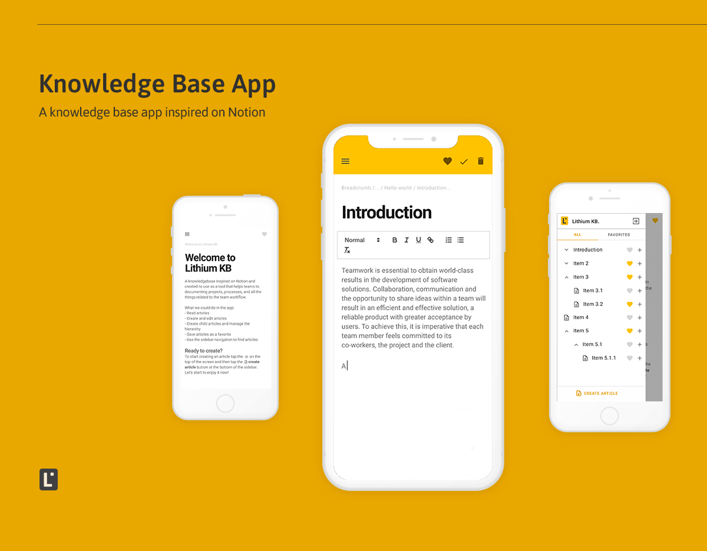

# Knowledge base app
A knowledge base app inspired on [Notion](https://www.notion.so/product) and created to use as a tool that helps teams to documenting projects, processes, and all the things related to the team workflow. Lithium KB is our in-house knowledge base application.

A project created with React Native and Apollo GraphQL

## Table of contents
1. [What is this?](#what-is-this)
2. [Why should you check this project?](#Why-should-you-check-this-project)
3. [Features](#features)
4. [Tech Stack](#tech-stack)
5. [Desing](#design)
6. [Get Ready?](#get-ready)
7. [How to use it](#How-to-use-it)
8. [How to customize this with your brand](#How-to-customize-this-with-your-brand)
9. [Credits](#credits)
10. [License](#license)

## What is this?
Lithium KB is our in-house knowledge base application. This project was born as a part of our new developers' training process, a way to learn the Javascript stack and our working team culture. Moreover, the project has another goal, it was to get a useful product for our company at the final of the training process.

## Why should you check this project?
Because:
* You are looking for developers to work on a project that requires experience working on React, Graphql, etc…
* You are a developer or a team of developers that want to learn more about how to work with (list of technologies).
* You need a tool like this to use on your side
* You want to learn how to implement some of the **features that we have implemented**

## Features
* Material Design alignments
* User Sign up and Sign in 
* Read articles
* Create and edit articles
* Create child articles and manage the hierarchy
* Save articles as a favorite
* Sidebar navigation with favorite tab
* Article breadcrumb
* Article last modification date

## Tech Stack
* React Native
* Paper Library
* Nodejs
* Apollo GraphQL
* Expo
* Vercel
* AWS - Aurora

## Design 
To this project, we decided to work following the [Material Design guidelines](https://material.io/design). That decision bring us the possibility to save a lot of time in the design phase, a way to not re-invent the wheel but ensuring a consistent visual language and trusted user experience.

Another good reason to use that is there are a lot of projects using Material Design and have this knowledge, it’s a strength that every high-performance team has to have.

Check our high-fidelity prototype worked on figma [here](https://www.figma.com/proto/y1YazGt8sO6bSd8GUCAJw8/Lithium-KB-final?node-id=19763%3A214&viewport=-5094%2C2163%2C1.3529388904571533&scaling=scale-down).

## Get ready?

## How to use it
We will talk about the architecture of the project and the folders that compose it.

> :warning: **If you haven't cloned the project already**: Please take a look at the [Get Ready guide](#get-ready) first.

After cloning, you can realize that at the root of the project we have two folders (docs and packages), and several files of configurations. For this guide, we will focus on the packages folder.
Inside the packages folder, you can find core, mobile, and web folders.

### Core folder
Codegen. This folder has the responsibility of having inside of it the Graphql generated code.
To fulfill this goal, it needs two folders called mutations and queries, and some configuration files.
Inside of these two folders is where you will add Graph Query Language (GQL) code to define mutations and queries, that will be used by Codegen to do the generation.
After adding a new GQL code for a mutation or query, you simply have to run the Codegen command and the code will be generated instantly, updating "generated/graphql.tsx" automatically.

### Mobile folder
What you see. This is the folder where React Native magic happens.
This folder is an Expo React Native project with some important libraries: React Navigation, React Native Paper, and Styled Components. It has the responsibility of containing the front-end of the app.
Like any project with these characteristics, it has some files, of which we will focus on App.tsx, and has some folders, of which we will describe: assets, components, navigation, and screens.

#### App.tsx
This is where all starts, this is the file that runs first.
Firstly we instantiate some components:
  - The React Native Paper Provider with a theme that you can customize (see customization guide).
  - The Apollo Provider to which we pass an Apollo Client.
  - The React Navigation Container.
Finally, we wrap our application inside all these Components, you will rarely change this file.

#### Assets folder
This folder contains the assets of the application, here we can customize, e.g.:
  - Icons we use (SVG files)
  - The app icon
  - The splash of the app
  - Fonts

#### Navigation folder
This folder only contains the AppNavigator.tsx which is a file that has the screens and navigators of React Navigation.
You will have to edit this file if you add a new screen to your project, or if you want to change the navigation flow of the app.
Read the [official React Navigation documentation](https://reactnavigation.org/docs/getting-started) for more information.

#### Screens folder
Here we got the main screens of the app. These screens are the ones that we put on the navigator in the AppNavigator.tsx file.
You will have to edit this file if you add a screen to your project, for example, a new completely different functionality to the app.
You can read the [official React Navigation documentation](https://reactnavigation.org/docs/getting-started) for more help building screens.

#### Components folder
This folder contains all the visual components of the project, except for the screens.
To create a new one, we create a new .tsx file inside this folder.
To style it, we can use [Styled Components](https://styled-components.com/docs) and we also can import some components from [React Native Paper](https://callstack.github.io/react-native-paper/) if necessary.
It is important to clarify that it is very common to put components one into another.

> :bulb: **It is crucial to understand the difference between a screen and a component**: The difference relies on the purpose of each one. The screens are meant to represent a complete view of the application, while the components have the purpose of populating the screens. One component might be used on different screens.

### Web folder
This is where Apollo GraphQL magic happens.
This folder has the responsibility of containing the back-end of the app.
It has some files and folders, of which we will focus on the pages and graphql folders.

#### Pages folder
Inside this folder, we can find another folder called api, and inside of it, a file called graphql.ts.
This file contains the [Apollo Server](https://www.apollographql.com/docs/apollo-server/getting-started/) configuration, including the initialization of the server with:
  - The type definitions and resolvers (imported from the folder we will introduce below)
  - And the context of the app which manages the current user token, and returns the database, req, res, and the current user id.

#### Graphql folder
This folder is really important. It contains three crucial folders inside of it:
  * Migrations, containing the migrations for the database, see the [official Sequelize migrations documentation](https://sequelize.org/master/manual/migrations.html) for more information
  * Models, with the models for the ORM of the app, you can ask the [official Sequelize models documentation](https://sequelize.org/master/manual/model-basics.html) for more details
  * Schemas, containing the graphql schemas and resolvers of each entity of the solution, in the [official documentation](https://graphql.org/learn/) you can find help to build these files

## How to customize this with your brand
If you want to customize the app with your brand to use in your company, follow the [customize document](docs/customize.md) to know how to do it.

## Credits
We'd like to thank these awesome people who made this project happen:
[Gerónimo Garcia](https://github.com/DogChef), [Bruno Pintos](https://github.com/brunopintos), [Max Techera](https://github.com/maxtechera) and [Marcelo Venturotti](https://github.com/mventurotti).

## License
